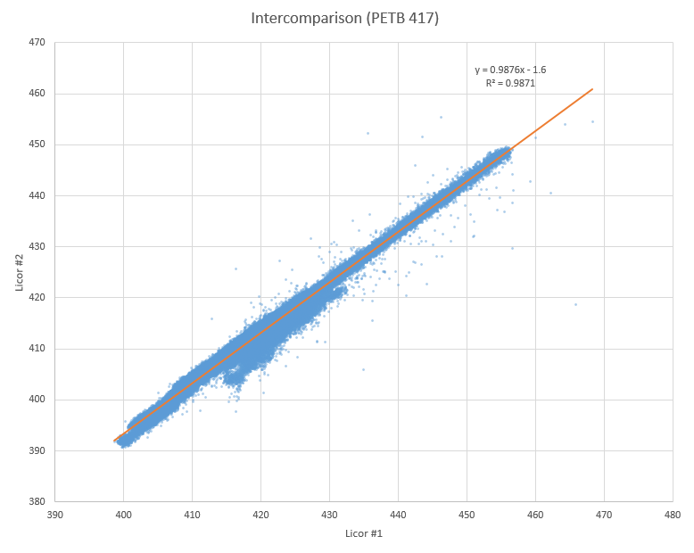

# Bench testing

### 2018 May 6-9th

Data collected by co-located LI-840A units #1 and 2, inside Paccar ETB 417.

Performance data ([zip archive](2018-05-06_Licor_comparison.zip)) was evaluated with Excel:

| CO2   | Licor #1   | Licor #2    |
|-------|------------|-------------|
| mean  |419.0423738 | 412.2458884 |
| stdev | 10.2546315 | 10.1936601  |

Regression eqn: `y = 0.9876x - 1.6`

